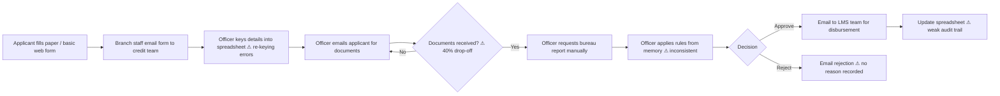
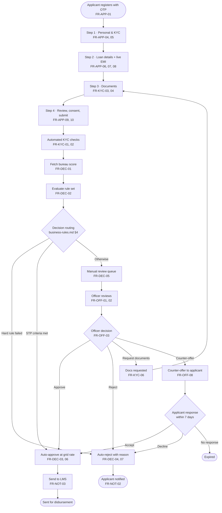
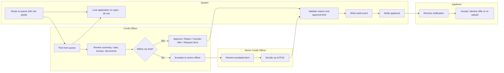
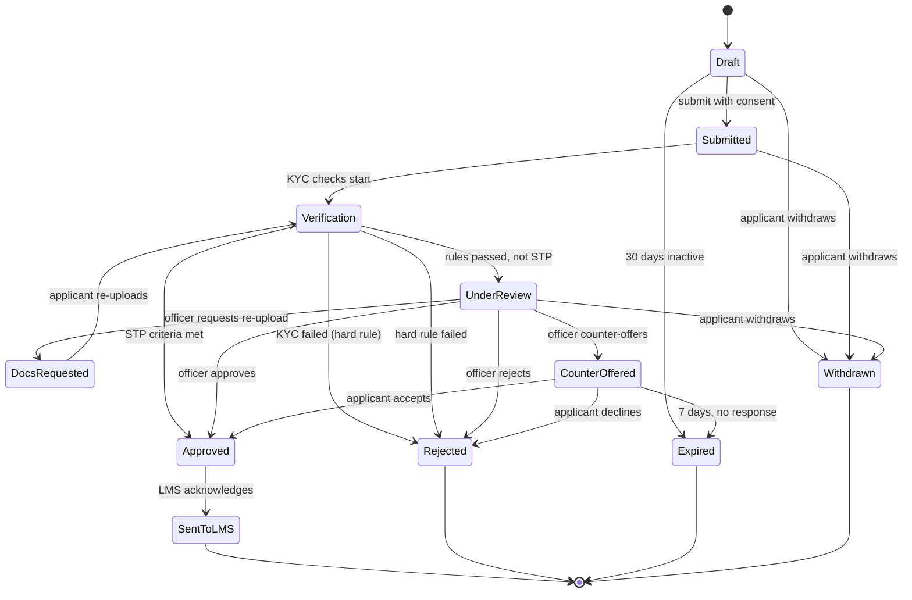
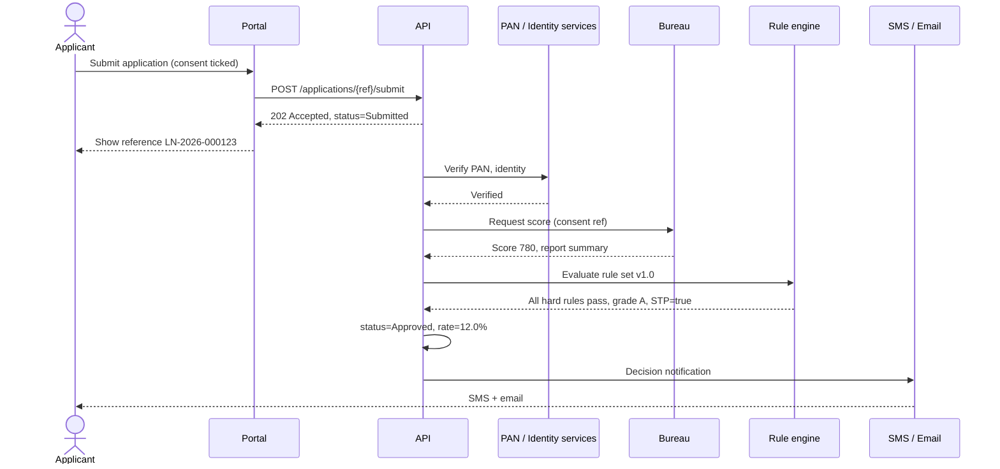
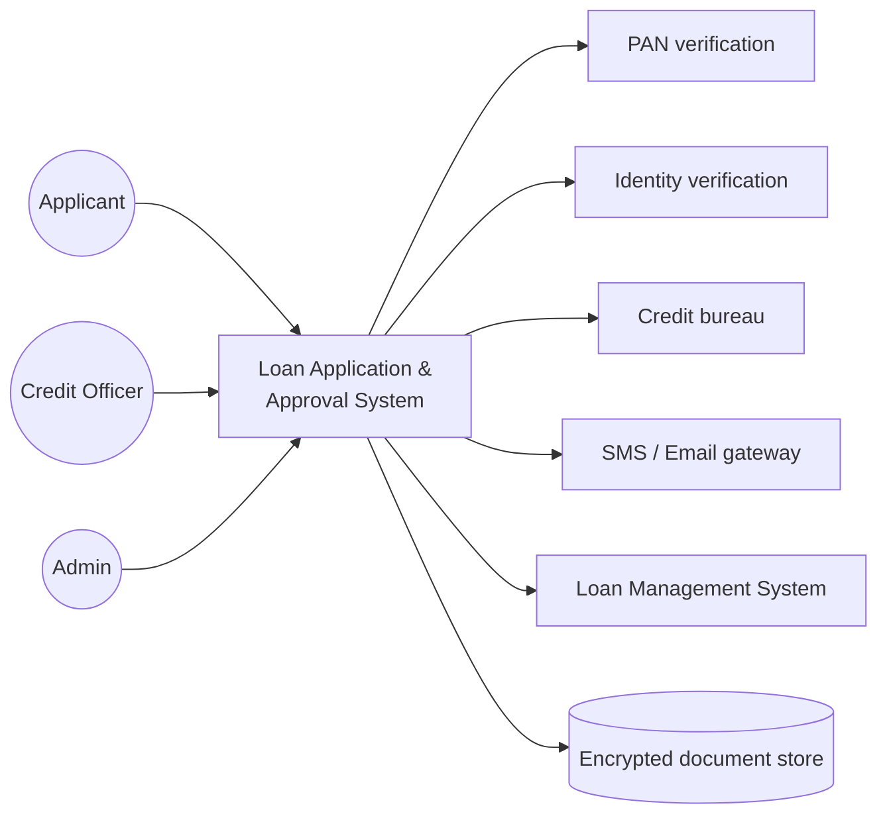

# Process Flows

Diagrams use Mermaid and render directly on GitHub. Each flow is annotated with the FRD requirements it realises.

---

## 1. Current state (as-is)

The manual process the system replaces. Pain points are marked ⚠.

---

## 2. Future state (to-be) — end-to-end application lifecycle

---

## 3. Swimlane — manual review

---

## 4. Application state machine

---

## 5. Sequence — submission to automated decision

---

## 6. Context diagram

